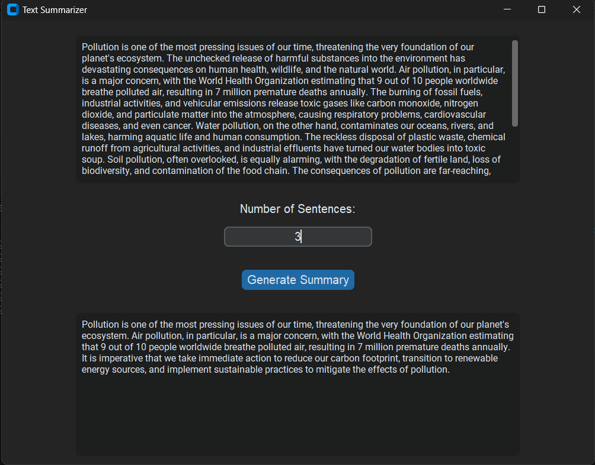

# Text Summarizer

This project is a simple yet powerful text summarizer application built using `customtkinter` for the GUI and NLP techniques for text summarization. It leverages `nltk` for tokenization and stemming, and `scikit-learn` for TF-IDF vectorization. The application can help users to quickly generate summaries from long pieces of text, making it easier to extract essential information.

## Features

- Summarizes input text to a specified number of sentences.
- Modern and user-friendly GUI using `customtkinter`.
- Utilizes Natural Language Processing (NLP) techniques for effective summarization.
- Lightweight and easy to use.

## Purpose

The purpose of this project is to provide a tool for summarizing long texts. This can be useful for students, researchers, writers, and professionals who need to quickly understand the main points of lengthy documents, articles, or reports.

## Installation

Follow these steps to set up and run the application:

1. Clone the repository:
   ```sh
   git clone https://github.com/YOUR_USERNAME/text-summarizer.git
   cd text-summarizer

2. Install the dependencies:
    Dependencies:
        The project relies on the following libraries:
            customtkinter: For creating a modern GUI.
            nltk: For natural language processing tasks such as tokenization and stemming.
            scikit-learn: For TF-IDF vectorization to evaluate the importance of sentences.
    Make sure to install these dependencies by running the command:
        ```sh
        pip install -r requirements.txt

3. Download NLTK data (if not already downloaded):
    ```sh
    python -m nltk.downloader punkt stopwords

4. Run the application:
    ```sh
    python app.py

5. Application Interface
    Text Input: Paste or type the text you want to summarize in the provided text box.
    Number of Sentences: Specify the number of sentences you want the summary to be.
    Generate Summary: Click the "Generate Summary" button to get the summarized text.
    Summary Output: The summarized text will be displayed in the output text box.

6. Example
    Here is an example of how the application works:
    Input Text: Paste a long piece of text into the input box.
    Specify Sentences: Enter the number of sentences for the summary.
    Get Summary: Click on the "Generate Summary" button to receive the summarized text.

7. Screenshots
    

8. Contributing
    Contributions are welcome! If you have suggestions for improvements or new features, please create a pull request or submit an issue.
    Fork the repository.    
    Create your feature branch (git checkout -b feature/YourFeature).
    Commit your changes (git commit -m 'Add some feature').
    Push to the branch (git push origin feature/YourFeature).
    Open a pull request.